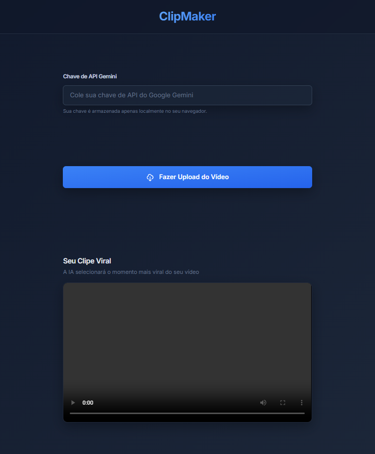

# 🎉 ClipMaker

💻 Projeto

O ClipMaker é uma aplicação web prática e intuitiva que permite gerar cortes virais em vídeos. Com ele vocë pode está gerando os seus cortes automáticos com a
utilização do cloudinary.   

---

## 💻 Tecnologias Utilizadas
- HTML5
- JAVASCRIPT
- GEMINI
- CLOUDINARY
- GITHUB COPILOT

